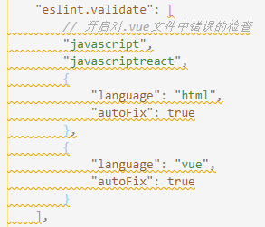
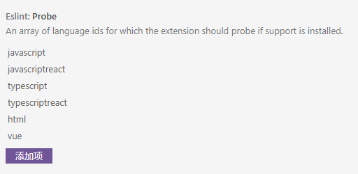

VS Code 升级后有关 ESlint 自动修复的配置有变更。
在`settings.json`文件中发现了如下报错

这个设置项已经弃用了，请使用 `editor.codeActionsOnSave` 和 `source.fixAll.eslint`。

<!--more-->

于是改成了下面这样：

```json
"editor.codeActionsOnSave": { //在保存时运行以下
    "source.fixAll.eslint": true // 开启eslint格式化工具
  }
```

下面还有一个报错：


```
Auto Fix is enabled by default. Use the single string form.
```

默认情况下`Auto Fix`已经启用了。

官方介绍是这么写的：

> `eslint.probe` = an array for language identifiers for which the ESLint extension should be activated and should try to validate the file. If validation fails for probed languages the extension says silent. Defaults to `["javascript", "javascriptreact", "typescript", "typescriptreact", "html", "vue"]`.

> `eslint.validate` - an array of language identifiers specifying the files for which validation is to be enforced. This is an old legacy setting and should in normal cases not be necessary anymore. Defaults to `["javascript", "javascriptreact"]`.

`eslint.validate`这个旧的属性已经不再需要了，而新属性`eslint.probe`默认值已经加入了`vue`和`html`文件的验证。

进到扩展设置里可看到这一项:


所以修改方法就是把`eslint.validate`这一项删除就好了。
