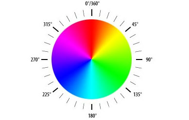
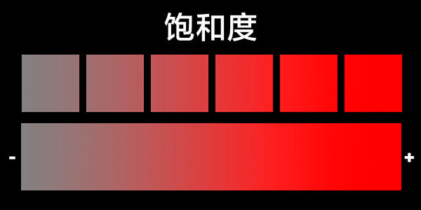
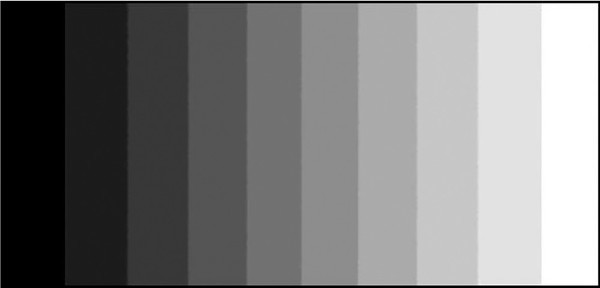
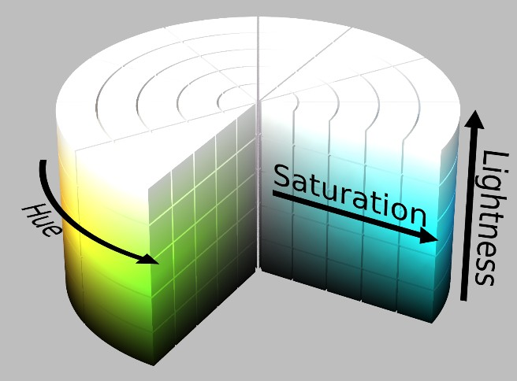
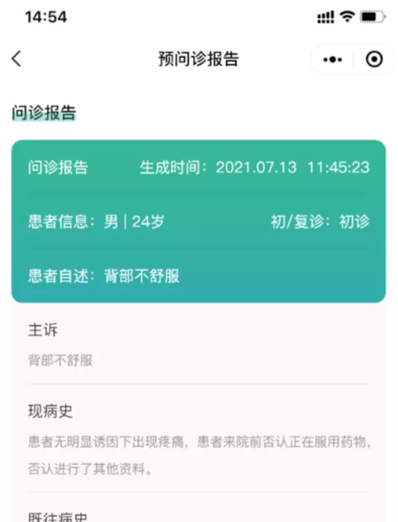
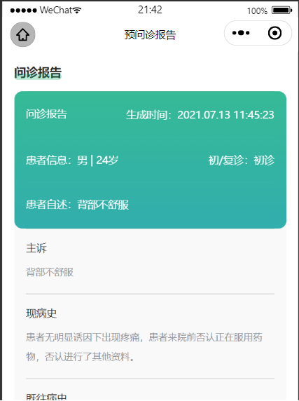

##  **什么是HSL**
　　很多朋友都听说过RGB颜色模型，即任何一种颜色，都是由红（Red）、绿（Green）、蓝（Blue）三原色以不同的比例相加而成的。
　　但是RGB模型对人类而言并不直观，比如我说一种颜色是由60%红，30%绿和90%蓝组成的，你应该很难想象出来，这到底是哪种颜色？
　　因此人们设计出了HSL色彩空间，来更加直观的表达颜色。HSL是色相（Hue）、饱和度（Saturation）和亮度（Lightness）这三个颜色属性的简称。
  
　　**色相（Hue）是色彩的基本属性，就是人们平常所说的颜色名称，如紫色、青色、品红等等。我们可以在一个圆环上表示出所有的色相。**
  


　　色环上的0度、120度、240度位置，分别对应了RGB模型的红、绿、蓝三原色。原色两两混合形成了二次色。比如黄色（60度）就是由红色和绿色混合而成；蓝色和绿色则相加形成青色（180度）；品红（300度）则由红蓝两色组成。
  
　　**饱和度（Saturation）是指色彩的纯度，饱和度越高色彩越纯越浓，饱和度越低则色彩变灰变淡。**



　　**亮度（Lightness）指的是色彩的明暗程度，亮度值越高，色彩越白，亮度越低，色彩越黑。**



　　我们把**色相（Hue）、饱和度（Saturation）和亮度（Lightness）**三个属性整合到一个圆柱中，就形成了HSL色彩空间模型。




##  **sass中对hsl颜色的计算**

`adjust-hue($color, $degrees)`: 修改给定颜色的色相值。
使用-360deg 到 360deg之间的角度，然后返架指定颜色hue旋转这个角度后有颜色(正：顺时针方向，负：逆时针方向)。

```css
adjust-hue(hsl(120, 30%, 90%), 60deg) => hsl(180, 30%, 90%)
adjust-hue(hsl(120, 30%, 90%), -60deg) => hsl(60, 30%, 90%)
adjust-hue(#811, 45deg) => #886a11
```

`lighten($color, $amount)`: 使一个颜色更亮。
```css
lighten(hsl(0, 0%, 0%), 30%) => hsl(0, 0, 30)
 ```
`darken($color, $amount)`: 使一个颜色变暗。
```css
darken(hsl(25, 100%, 80%), 30%) => hsl(25, 100%, 50%)
 ```

`saturate($color, $amount)`: 使一个颜色更加饱和。
`desaturate($color, $amount)`: 减少一个颜色的饱和度。

`adjust-color($color, [$red], [$green], [$blue], [$hue], [$saturation], [$lightness], [$alpha]) `: 对指定的颜色增加或减少相应一个或多个颜色值。
```css
adjust-color(#102030, $blue: 5) => #102035
adjust-color(#102030, $red: -5, $blue: 5) => #0b2035
adjust-color(hsl(25, 100%, 80%), $lightness: -30%, $alpha: -0.4) => hsla(25, 100%, 50%, 0.6)
 ```
`scale-color($color, [$red], [$green], [$blue], [$saturation], [$lightness], [$alpha]) `: 通过调整颜色的一个或者多个属性获取一个流畅颜色。
```css
scale-color(hsl(120, 70%, 80%), $lightness: 50%) => hsl(120, 70%, 90%)
scale-color(rgb(200, 150%, 170%), $green: -40%, $blue: 70%) => rgb(200, 90, 229)
scale-color(hsl(200, 70%, 80%), $saturation: -90%, $alpha: -30%) => hsla(200, 7%, 80%, 0.7)
 ```
`change-color($color, [$red], [$green], [$blue], [$hue], [$saturation], [$lightness], [$alpha]) `: 在该函数中传入的参数将直接替换原来的值，而不做任何的运算。
```css
change-color(#102030, $blue: 5) => #102005
change-color(#102030, $red: 120, $blue: 5) => #782005
change-color(hsl(25, 100%, 80%), $lightness: 40%, $alpha: 0.8) => hsla(25, 100%, 40%, 0.8)
 ```
 
## **项目中的实际应用**
比如智慧医院里有个功能叫“预问诊报告”，患者信息的部分有一个渐变。通过对当前主题色进行HSL计算，可以得到一个和UI几乎一致的渐变颜色效果。
```css
.user-info {
  padding: 0 30rpx;
  background: linear-gradient(180deg, hsl(164, 94%, 34%) 0%, hsl(180, 100%, 30%) 100%);
  opacity: 0.8;
  border-radius: 20rpx;
}
```

UI图




HSL计算效果


